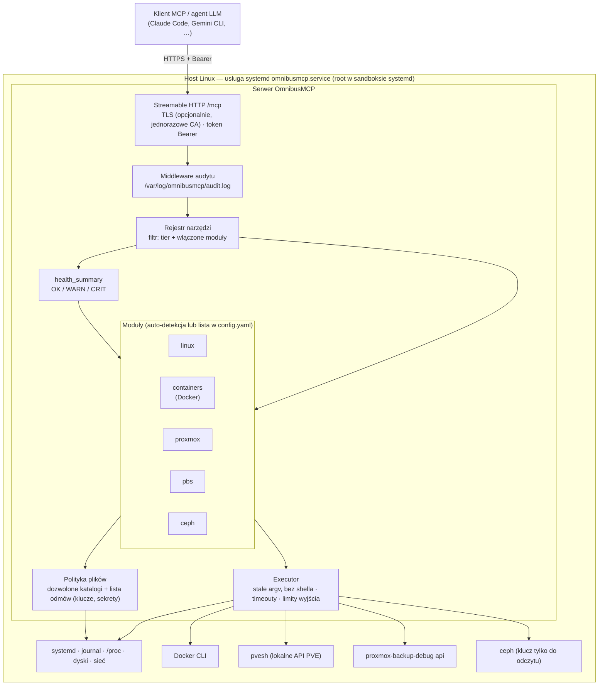

# OmnibusMCP

Dedykowany serwer Model Context Protocol (MCP) dla hostów Linux, umożliwiający agentom LLM szybką diagnozę bieżącego stanu serwera i kluczowych usług infrastrukturalnych.

**Status**: Wersja 0.6.1 — etapy 2–5 ukończone, moduły linux, containers (Docker), proxmox, pbs, ceph (Tier 1). Wykonanie: Go 1.25+, go-sdk v1.8.0, 47 narzędzi (46 w modułach + health\_summary), audyt, tiery, executor (RunData, limit równoczesnych), serwer HTTP/Bearer, install/uninstall/status/upgrade, TLS, hardening systemd, kolory CLI, zgodność wersji. Testowane na Debian 13, Proxmox VE 9.2, Proxmox Backup Server 4.0 i Ceph 18.2 / 20.2.

## Funkcjonalności

- **Modułowe profile** — auto-detekcja dostępnych technologii: Linux (zawsze), containers (Docker/Podman), Proxmox VE, Proxmox Backup Server, Ceph.
- **Tiery dostępu** — Tier 1 (read-only), Tier 2 (+ restartowanie usług), architektura otwarta na Tier 3+.
- **Bezpieczny executor** — każde narzędzie to konkretne polecenie ze stałymi argumentami (brak generycznego shella); timeouty, limity wyjścia, audyt każdego wywołania.
- **Health summary** — jedno wywołanie zwraca zagregowany stan hosta i modułów (OK/WARN/CRIT).
- **Transport MCP Streamable HTTP** — uwierzytelnianie tokenem Bearer; domyślnie localhost (tunel SSH), opcjonalnie TLS.
- **Aktualizacja jednym poleceniem** — `omnibusmcp upgrade` pobiera wydanie z GitHuba, weryfikuje SHA-256 i przy nieudanym starcie usługi wraca do poprzedniej wersji (sekcja [Aktualizacja](#aktualizacja)).

## Schemat architektury



Domyślny nasłuch to `127.0.0.1:8765`; dostęp z sieci wymaga `--listen`, a adres sieciowy włącza [TLS](docs/tls.md) automatycznie.

## Moduły i tiery


| Moduł                                        | Zakres                                                                                     | Tier 1      | Autodetekcja                                   |
| -------------------------------------------- | ------------------------------------------------------------------------------------------ | ----------- | ---------------------------------------------- |
| [**linux**](docs/modules/linux.md)           | systemd, journal, dyski, sieć, obciążenie, pamięć, tożsamość hosta, zadania cykliczne (timery, cron) | 11 narzędzi | zawsze włączony                                |
| [**containers**](docs/modules/containers.md) | Docker: runtime, kontenery, logi, statystyki, zajętość dysku, sieci, zdarzenia             | 8 narzędzi  | `docker` + `/run/docker.sock`                  |
| [**proxmox**](docs/modules/proxmox.md)       | Proxmox VE: węzeł, klaster/kworum, VM i kontenery, storage, zadania, aktualizacje, backupy | 10 narzędzi | `/etc/pve` + `pvesh`                           |
| [**pbs**](docs/modules/pbs.md)               | Proxmox Backup Server: datastore'y, garbage collection, backupy, zadania, aktualizacje     | 8 narzędzi  | `/etc/proxmox-backup` + `proxmox-backup-debug` |
| [**ceph**](docs/modules/ceph.md)             | Ceph (cephadm, Proxmox VE): stan klastra, OSD, pule, PG, CephFS; demony, dyski, crashe i logi tego hosta | 9 narzędzi (7 w trybie pełnym) | `/etc/pve/ceph.conf` lub `/var/lib/ceph`      |


Wszystkie narzędzia działają w Tier 1 (tylko odczyt). Moduł ceph zakłada klucz `client.omnibusmcp` tylko do odczytu, co opisuje [dokumentacja modułu](docs/modules/ceph.md). Tier 2 funkcjonalności (restartowanie usług) będą określone dla poszczególnych modułów w fazie wdrażania. Konfiguracja modułów (auto-detekcja, jawna lista): [docs/modules/README.md](docs/modules/README.md).

## Wymagania

- **Go 1.25+** (go-sdk v1.8.0) — do budowania ze źródeł
- **Dystrybucje**: Debian, Ubuntu, AlmaLinux (tylko Debian 13 przetestowana)
- **Dostęp**: root do instalacji usługi systemd
- **Opcjonalnie**: tunel SSH (dla domyślnego nasłuchu na localhost)
- **Opcjonalnie**: dostęp do GitHuba (dla `upgrade` i wiersza `Update` w `status`; repozytorium jest publiczne)

## Instalacja

### Jednym poleceniem (najnowsza wersja)

Skrypt `install.sh`, dołączany do każdego wydania, rozpoznaje architekturę (amd64/arm64), pobiera binarkę najnowszego wydania, sprawdza ją z `SHA256SUMS`, instaluje do `/usr/local/bin` i — jeśli usługa już działa — restartuje ją z nową wersją. Ten sam adres zawsze wskazuje najnowsze wydanie:

```bash
curl -fsSL https://github.com/PNT-Data-Center/omnibusmcp/releases/latest/download/install.sh | sudo bash

# wybrana wersja
curl -fsSL https://github.com/PNT-Data-Center/omnibusmcp/releases/latest/download/install.sh | sudo bash -s -- --version v0.4.1

# instalacja i od razu konfiguracja usługi na adresie sieciowym (parametry jak w "omnibusmcp install"; TLS włączany automatycznie)
curl -fsSL https://github.com/PNT-Data-Center/omnibusmcp/releases/latest/download/install.sh | sudo bash -s -- --install --listen 192.0.2.10:8765
```

Opcje skryptu: `--version vX.Y.Z`, `--install [parametry]`, `--help`; zmienne: `OMNIBUSMCP_REPO`, `OMNIBUSMCP_BASE_URL`, `OMNIBUSMCP_BIN_DIR`. Token `GH_TOKEN` lub `GITHUB_TOKEN` jest opcjonalny: gdy jest ustawiony, skrypt pobiera wydania przez API GitHuba zamiast bezpośrednich adresów. `sudo` nie przenosi zmiennych środowiskowych, więc przekaż je jawnie, np. `sudo GH_TOKEN="$TOKEN" bash`. Skrypt działa w całości dopiero po pobraniu (funkcja wywoływana w ostatniej linii), więc przerwane pobieranie niczego nie uruchomi. Suma SHA-256 chroni przed uszkodzonym pobraniem, nie przed podmianą wydania.

### Z wydania (binarki)

Każde wydanie zawiera statyczne binarki `omnibusmcp-linux-amd64` i `omnibusmcp-linux-arm64` oraz plik `SHA256SUMS`.

```bash
VER=v0.6.1
ARCH=$(dpkg --print-architecture 2>/dev/null || uname -m | sed 's/x86_64/amd64/;s/aarch64/arm64/')

BASE="https://github.com/PNT-Data-Center/omnibusmcp/releases/download/$VER"
curl -fsSLO "$BASE/omnibusmcp-linux-$ARCH"
curl -fsSLO "$BASE/SHA256SUMS"

sha256sum -c --ignore-missing SHA256SUMS
install -m 0755 "omnibusmcp-linux-$ARCH" /usr/local/bin/omnibusmcp
omnibusmcp version            # omnibusmcp v0.6.1
omnibusmcp install            # dalej: docs/service.md
```

### Ze źródeł

**Instalacja wydania (metoda Go)**:

```bash
# Zainstaluj wydanie bezpośrednio przez Go (Go 1.25+)
go install github.com/PNT-Data-Center/omnibusmcp/cmd/omnibusmcp@v0.6.1

# Binarka zainstalowana w $GOPATH/bin/omnibusmcp (domyślnie ~/go/bin/)
omnibusmcp version            # omnibusmcp v0.6.1
```

**Build ze źródeł z wersją**:

```bash
# Klonowanie repozytorium
git clone https://github.com/PNT-Data-Center/omnibusmcp.git
cd omnibusmcp

# Checkout wersji 0.6.1
git checkout v0.6.1

# Budowanie z wersją (pseudowersja z Git)
CGO_ENABLED=0 go build -trimpath \
  -ldflags "-s -w -X main.version=$(git describe --tags)" \
  -o omnibusmcp ./cmd/omnibusmcp

# Sprawdzenie wersji
./omnibusmcp version          # omnibusmcp v0.6.1

# Wyświetlenie dostępnych poleceń
./omnibusmcp --help
```

**Notatka**: Flaga `-ldflags "-X main.version=..."` ustawia wersję przy compile-time. Gdy flagi brakuje, wersja pochodzi z `runtime/debug.ReadBuildInfo()`: przy `go install @vX.Y.Z` bierze wersję modułu, przy build lokalnym — pseudowersja z Git commit.

## Szybki start

```bash
# 1. Instalacja i uruchomienie usługi (Tier 1, auto-detekcja modułów, nasłuch 127.0.0.1:8765)
sudo omnibusmcp install

# 2. Stan usługi i adres endpointu MCP
sudo omnibusmcp status
```

Dostęp z sieci: `sudo omnibusmcp install --listen 192.0.2.10:8765`. Instalator włącza TLS i wypisuje instrukcję dla klientów (szczegóły: [Dostęp sieciowy i TLS](#dostęp-sieciowy-i-tls)).

Dalej: [podłączenie klienta](docs/clients.md) (Claude Code, Gemini CLI, Cursor, inne), [TLS](docs/tls.md), [zarządzanie usługą](docs/service.md).

## Dostęp sieciowy i TLS

Domyślnie usługa nasłuchuje na `127.0.0.1:8765` i jest dostępna przez tunel SSH. Adres sieciowy podany w `--listen` włącza HTTPS automatycznie:

```bash
sudo omnibusmcp install --listen 192.0.2.10:8765
```

Przed startem usługi instalator:

1. zapisuje w `config.yaml` ścieżki `tls.cert_file` i `tls.key_file` (`/etc/omnibusmcp/tls/cert.pem` i `key.pem`),
2. generuje certyfikat podpisany jednorazowym lokalnym CA; nazwy hostów (w tym adres z `--listen`) wykrywa automatycznie; klucz CA nie jest zapisywany na dysku,
3. zapisuje zdarzenie `tls_generate` w logu audytu,
4. na końcu wypisuje instrukcję konfiguracji klientów (jak `omnibusmcp tls client-setup`).

Istniejący certyfikat jest zachowywany. Klienci muszą raz zaufać CA serwera i dostać token. Gotowa, krótka instrukcja (zaufanie, token, `claude mcp add`) jest w wydruku `sudo omnibusmcp tls client-setup` oraz pod adresem `https://HOST:8765/`: przeglądarka pokazuje ją jako stronę z przyciskami „Kopiuj”, a `curl -k` jako czysty tekst; szczegóły: [Podłączenie klienta](docs/clients.md). Model certyfikatu: [HTTPS / TLS](docs/tls.md).

Plain HTTP na adresie sieciowym wymaga jawnej zgody:

```bash
sudo omnibusmcp install --listen 192.0.2.10:8765 --allow-insecure-remote
```

Ustawia `allow_insecure_remote: true` i nie tworzy certyfikatu. Ruch, w tym token Bearer, idzie bez szyfrowania, więc używaj tej opcji tylko w zaufanej sieci wewnętrznej.

Istniejąca konfiguracja: jeśli `config.yaml` już istnieje, `install` z `--listen`, `--tier`, `--modules` lub `--allow-insecure-remote` kończy się błędem zamiast po cichu pominąć te flagi. Dodaj `--force`, aby przepisać konfigurację (token zostaje). `install` bez tych flag zachowuje konfigurację bez zmian; tak działa też `upgrade`.

Zmiana adresu: istniejący certyfikat zostaje także po zmianie `--listen`. Jeśli nowy adres nie znajduje się w jego nazwach hostów, wygeneruj certyfikat ponownie poleceniem `sudo omnibusmcp tls generate --force` (w razie potrzeby z `--hosts`). Powstaje wtedy nowe CA, więc klienci muszą mu zaufać ponownie.

## Aktualizacja

Zainstalowaną binarkę aktualizuje polecenie `upgrade`, które pobiera wydanie z GitHuba:

```bash
# Sprawdzenie, czy jest nowsze wydanie (bez roota)
omnibusmcp upgrade --check

# Aktualizacja do najnowszego wydania
sudo omnibusmcp upgrade

# Wybrana wersja; starsza wersja (downgrade) wymaga potwierdzenia
sudo omnibusmcp upgrade --version v0.4.1
```

Przebieg aktualizacji:

1. Pobranie `omnibusmcp-linux-<arch>` i `SHA256SUMS` z wydania; suma SHA-256 musi się zgadzać. Przy niezgodności nic nie zostaje zainstalowane.
2. Nowa binarka jest zapisywana obok obecnej i sprawdzana (`version` musi zwrócić wybrany tag).
3. Poprzednia binarka zostaje jako `<binarka>.prev`, a nowa zastępuje ją atomowo. Celem jest binarka, którą uruchamia zainstalowana usługa; bez usługi — `/usr/local/bin/omnibusmcp`.
4. Nowa binarka wykonuje `omnibusmcp install`: zachowuje konfigurację i token, odświeża jednostki systemd i restartuje usługę.
5. Po 5 sekundach usługa musi być aktywna. Jeśli nie, polecenie przywraca poprzednią binarkę, uruchamia usługę ponownie i kończy się błędem; diagnostyka: `journalctl -u omnibusmcp -n 50`.

Opcje: `--check` (tylko sprawdzenie), `--version vX.Y.Z` (wybrana wersja), `--force` (reinstalacja tej samej wersji), `--yes` (bez pytań: downgrade lub build deweloperski). Downgrade pyta o potwierdzenie na terminalu; bez terminala wymaga `--yes`. Build deweloperski (wersja `dev+…` lub pseudo-wersja Go) aktualizuje się tylko z `--yes`. Równoległe aktualizacje wykluczają się blokadą `/run/lock/omnibusmcp-upgrade.lock`.

Uwagi:

- Ponowne `install` uruchamia usługę także wtedy, gdy była zatrzymana.
- Aktualizacja nie zmienia `config.yaml`; migracji konfiguracji między wersjami na razie nie ma.
- Suma SHA-256 chroni przed uszkodzonym pobraniem, nie przed podmianą wydania (brak podpisów).
- Polecenie nie wymaga tokena GitHuba (wydania są publiczne). Alternatywne źródło wskazuje zmienna `OMNIBUSMCP_BASE_URL`.

Wiersz `Update` w `omnibusmcp status` pokazuje, czy jest nowsze wydanie (`vX.Y.Z available (sudo omnibusmcp upgrade)`), czy wersja jest aktualna (`up to date`), czy to build deweloperski, albo że sprawdzenie się nie udało (brak dostępu do GitHuba). Sprawdzenie trwa najwyżej 2 sekundy i nie wpływa na kod wyjścia `status`.

## Konfiguracja

Plik konfiguracji znajduje się w `/etc/omnibusmcp/config.yaml` (tworzy się podczas instalacji):

```yaml
# Nasłuch — adres i port serwera MCP
# Domyślnie: 127.0.0.1:8765 (localhost, wymaga SSH tunnel dla dostępu zdalnego)
# Inne przykłady:
#   [::1]:8765              — IPv6 loopback
#   192.0.2.10:8765         — konkretny interfejs (install z tym adresem włącza TLS, zob. Dostęp sieciowy i TLS)
#   0.0.0.0:8765            — wszystkie interfejsy (jak wyżej)
listen: 127.0.0.1:8765

# Tier dostępu (1 = read-only, 2 = + restartowanie usług)
tier: 1

# Moduły: auto (auto-detekcja) lub jawnie: linux, containers, ceph, proxmox, pbs
modules:
  - auto

# Plik tokenu Bearer (generowany przy install)
token_file: /etc/omnibusmcp/token

# TLS (pusta wartość = HTTP). Przy install z adresem sieciowym wypełniane automatycznie;
# ręcznie: omnibusmcp tls generate
tls:
  cert_file: ""
  key_file: ""

# Czy zezwolić nasłuchowi poza loopback bez TLS (domyślnie false; ustawiane przez install --allow-insecure-remote)
# false = wymusa SSH tunnel lub TLS dla bezpieczeństwa
# true = pozwala na niezaszyfrowany dostęp sieciowy (TYLKO dla wewnętrznych sieci)
allow_insecure_remote: false

# Audit log (JSON lines) — loguje każde wywołanie narzędzia
audit_log: /var/log/omnibusmcp/audit.log

# Limity wykonania
limits:
  command_timeout: 15s      # timeout dla poleceń
  health_timeout: 30s       # timeout dla health checks
  max_output_bytes: 65536   # limit rozmiaru wyjścia (64 KiB)

# Ceph (moduł ceph): wszystkie pola opcjonalne; puste = ustawienia domyślne
ceph:
  conf: ""          # ceph.conf (bezwzględna ścieżka); pusta: /etc/ceph/ceph.conf lub konfiguracja demona cephadm
  keyring: ""       # klucz client.omnibusmcp; pusta: /etc/omnibusmcp/ceph.client.omnibusmcp.keyring, potem /etc/pve/priv/
  cluster: auto     # auto = pytaj klaster, gdy jest klucz; false = tylko widok lokalny (demony, crashe, logi)
```

Konfiguracja modułów: zobacz [Moduły](docs/modules/README.md).

## Dokumentacja


| Temat                                                 | Opis                                                                                          |
| ----------------------------------------------------- | --------------------------------------------------------------------------------------------- |
| [**Moduły**](docs/modules/README.md)                  | Auto-detekcja, konfiguracja, lista narzędzi w każdym module (linux, containers, proxmox, pbs, ceph) |
| [**Instalacja jako usługa systemd**](docs/service.md) | Instalacja, zarządzanie, diagnostyka, kolory CLI, polecenie `status`                          |
| [**HTTPS / TLS**](docs/tls.md)                        | Generowanie certyfikatu, automatyczne odnawianie, wyłączenie TLS                              |
| [**Podłączenie klienta AI**](docs/clients.md)         | Konfiguracja Claude Code, Gemini CLI, Cursor, Antigravity, przygotowanie hosta klienta        |
| [**Bezpieczeństwo**](docs/security.md)                | Hardening, audyt, dostęp do sekretów, znane problemy                                          |
| [**Zgodność wersji**](docs/compatibility.md)          | Testowane wersje, tolerancja API, testy kontraktowe                                           |


## Testy

### Testy jednostkowe i integracyjne

```bash
# Uruchomienie wszystkich testów
go test ./...

# Testy konkretnego pakietu
go test ./internal/config ./internal/executor ./internal/install ./internal/modules/linux

# Z verbose output
go test -v ./...
```

## Struktura repozytorium

```
omnibusmcp/
├── cmd/omnibusmcp/        # CLI: serve, install, uninstall, status, detect, tools, tls, upgrade, version
├── docs/                  # Dokumentacja: moduły, TLS, klienci, bezpieczeństwo, zgodność
│   ├── modules/           # Dokumentacja modułów: linux, containers, proxmox, pbs, ceph
│   ├── compatibility.md   # Testowane wersje, tolerancja API
│   ├── service.md         # Instalacja jako usługa systemd
│   ├── tls.md             # Certyfikat, automatyczne odnawianie
│   ├── clients.md         # Podłączenie klientów MCP
│   └── security.md        # Audyt, hardening, sekrety
├── internal/
│   ├── audit/             # dziennik audytu (JSON lines)
│   ├── certs/             # certyfikat TLS self-signed (generowanie, odnawianie)
│   ├── compat/            # tabela przetestowanych wersji produktów
│   ├── config/            # config.yaml (wczytywanie, walidacja, edycja z komentarzami)
│   ├── executor/          # uruchamianie poleceń bez shella (timeouty, limity wyjścia)
│   ├── install/           # instalacja usługi systemd i timera odnawiania TLS
│   ├── jsonx/             # tolerancyjny dekoder JSON
│   ├── modules/           # moduły: linux, containers, proxmox, pbs, ceph (+ wspólny aptrepo)
│   ├── registry/          # rejestr narzędzi, tiery, health checks
│   ├── server/            # serwer MCP (Streamable HTTP, Bearer, TLS, health_summary)
│   ├── tier/              # poziomy uprawnień
│   ├── ui/                # kolory w wyjściu CLI
│   └── upgrade/           # pobieranie wydań z GitHuba, weryfikacja SHA-256, podmiana binarki
├── install.sh             # instalator najnowszego wydania (curl … | sudo bash)
├── go.mod
└── go.sum
```

## Roadmap

**Gotowe**

- Rdzeń: konfiguracja, rejestr narzędzi z tierami, executor, audyt, auto-detekcja modułów
- Moduły Tier 1 (read-only): linux, containers (Docker), proxmox (Proxmox VE), pbs (Proxmox Backup Server), ceph (cephadm i pakiety, także pveceph; testy na klastrach w toku)
- `health_summary`, instalacja jako usługa systemd z hardeningiem, `status`, TLS self-signed z automatycznym odnawianiem
- Zgodność wersji produktów, tolerancyjny dekoder JSON, testy kontraktowe na zanonimizowanych nagraniach API
- Wydania binarne linux/amd64 i linux/arm64 z sumami SHA256
- Aktualizacja binarki (`omnibusmcp upgrade`) z weryfikacją SHA-256 i powrotem do poprzedniej wersji przy błędzie usługi

**Planowane**

- Tier 2: restartowanie usług (w tym demonów Ceph)
- Podman w module containers

## Autor

Kamil Kobak

## Licencja

Copyright (C) 2026 Kamil Kobak

GNU General Public License v3.0 — pełny tekst w pliku `LICENSE`.
