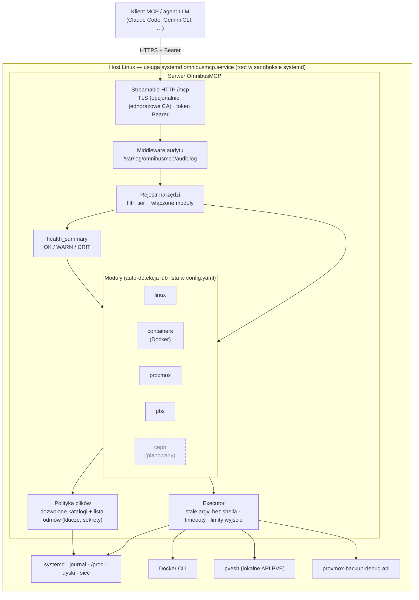

# OmnibusMCP

Dedykowany serwer Model Context Protocol (MCP) dla hostów Linux, umożliwiający agentom LLM szybką diagnozę bieżącego stanu serwera i kluczowych usług infrastrukturalnych.

**Status**: Wersja 0.4.1 — etapy 2–5 ukończone, moduły linux, containers (Docker), proxmox, pbs (Tier 1). Wykonanie: Go 1.25+, go-sdk v1.8.0, 38 narzędzi (37 w modułach + health\_summary), audyt, tiery, executor (RunData, limit równoczesnych), serwer HTTP/Bearer, install/uninstall/status, TLS, hardening systemd, kolory CLI, zgodność wersji. Testowane na Debian 13, Proxmox VE 9.2 i Proxmox Backup Server 4.0.

## Funkcjonalności

- **Modułowe profile** — auto-detekcja dostępnych technologii: Linux (zawsze), containers (Docker/Podman), Proxmox VE, Proxmox Backup Server, Ceph.
- **Tiery dostępu** — Tier 1 (read-only), Tier 2 (+ restartowanie usług), architektura otwarta na Tier 3+.
- **Bezpieczny executor** — każde narzędzie to konkretne polecenie ze stałymi argumentami (brak generycznego shella); timeouty, limity wyjścia, audyt każdego wywołania.
- **Health summary** — jedno wywołanie zwraca zagregowany stan hosta i modułów (OK/WARN/CRIT).
- **Transport MCP Streamable HTTP** — uwierzytelnianie tokenem Bearer; domyślnie localhost (tunel SSH), opcjonalnie TLS.

## Schemat architektury



Linie przerywane oznaczają elementy planowane. Domyślny nasłuch to `127.0.0.1:8765`; dostęp z sieci wymaga `--listen` i zalecanego [TLS](docs/tls.md).

## Moduły i tiery


| Moduł                                        | Zakres                                                                                     | Tier 1      | Autodetekcja                                   |
| -------------------------------------------- | ------------------------------------------------------------------------------------------ | ----------- | ---------------------------------------------- |
| [**linux**](docs/modules/linux.md)           | systemd, journal, dyski, sieć, obciążenie, pamięć, tożsamość hosta, zadania cykliczne (timery, cron) | 11 narzędzi | zawsze włączony                                |
| [**containers**](docs/modules/containers.md) | Docker: runtime, kontenery, logi, statystyki, zajętość dysku, sieci, zdarzenia             | 8 narzędzi  | `docker` + `/run/docker.sock`                  |
| [**proxmox**](docs/modules/proxmox.md)       | Proxmox VE: węzeł, klaster/kworum, VM i kontenery, storage, zadania, aktualizacje, backupy | 10 narzędzi | `/etc/pve` + `pvesh`                           |
| [**pbs**](docs/modules/pbs.md)               | Proxmox Backup Server: datastore'y, garbage collection, backupy, zadania, aktualizacje     | 8 narzędzi  | `/etc/proxmox-backup` + `proxmox-backup-debug` |
| ceph                                         | —                                                                                          | —           | planowany                                      |


Wszystkie narzędzia działają w Tier 1 (tylko odczyt). Tier 2 funkcjonalności (restartowanie usług) będą określone dla poszczególnych modułów w fazie wdrażania. Konfiguracja modułów (auto-detekcja, jawna lista): [docs/modules/README.md](docs/modules/README.md).

## Wymagania

- **Go 1.25+** (go-sdk v1.8.0) — do budowania ze źródeł
- **Dystrybucje**: Debian, Ubuntu, AlmaLinux (tylko Debian 13 przetestowana)
- **Dostęp**: root do instalacji usługi systemd
- **Opcjonalnie**: tunel SSH (dla domyślnego nasłuchu na localhost)

## Instalacja

### Jednym poleceniem (najnowsza wersja)

Skrypt `install.sh`, dołączany do każdego wydania, rozpoznaje architekturę (amd64/arm64), pobiera binarkę najnowszego wydania, sprawdza ją z `SHA256SUMS`, instaluje do `/usr/local/bin` i — jeśli usługa już działa — restartuje ją z nową wersją. Ten sam adres zawsze wskazuje najnowsze wydanie:

```bash
curl -fsSL https://github.com/PNT-Data-Center/omnibusmcp/releases/latest/download/install.sh | sudo bash

# wybrana wersja
curl -fsSL https://github.com/PNT-Data-Center/omnibusmcp/releases/latest/download/install.sh | sudo bash -s -- --version v0.4.1

# instalacja i od razu konfiguracja usługi (parametry jak w "omnibusmcp install")
curl -fsSL https://github.com/PNT-Data-Center/omnibusmcp/releases/latest/download/install.sh | sudo bash -s -- --install --listen 192.0.2.10:8765
```

Dopóki repozytorium jest prywatne, adresy wydań wymagają uwierzytelnienia. Skrypt korzysta wtedy z API GitHuba z tokenem (`GH_TOKEN`); token trzeba przekazać jawnie, bo `sudo` nie przenosi zmiennych środowiskowych:

```bash
gh release download -R PNT-Data-Center/omnibusmcp -p install.sh -O - | sudo GH_TOKEN="$(gh auth token)" bash
```

Opcje skryptu: `--version vX.Y.Z`, `--install [parametry]`, `--help`; zmienne: `GH_TOKEN`/`GITHUB_TOKEN`, `OMNIBUSMCP_REPO`, `OMNIBUSMCP_BASE_URL`, `OMNIBUSMCP_BIN_DIR`. Skrypt działa w całości dopiero po pobraniu (funkcja wywoływana w ostatniej linii), więc przerwane pobieranie niczego nie uruchomi. Suma SHA-256 chroni przed uszkodzonym pobraniem, nie przed podmianą wydania.

### Z wydania (binarki)

Każde wydanie zawiera statyczne binarki `omnibusmcp-linux-amd64` i `omnibusmcp-linux-arm64` oraz plik `SHA256SUMS`.

```bash
VER=v0.4.1
ARCH=$(dpkg --print-architecture 2>/dev/null || uname -m | sed 's/x86_64/amd64/;s/aarch64/arm64/')

# Repozytorium publiczne: bezpośredni adres plików wydania
BASE="<adres-repozytorium>/releases/download/$VER"
curl -fsSLO "$BASE/omnibusmcp-linux-$ARCH"
curl -fsSLO "$BASE/SHA256SUMS"

# Repozytorium prywatne na GitHubie: przez GitHub CLI (gh auth login)
#   gh release download "$VER" -R <organizacja>/omnibusmcp -p "omnibusmcp-linux-$ARCH" -p SHA256SUMS

sha256sum -c --ignore-missing SHA256SUMS
install -m 0755 "omnibusmcp-linux-$ARCH" /usr/local/bin/omnibusmcp
omnibusmcp version            # omnibusmcp v0.4.1
omnibusmcp install            # dalej: docs/service.md
```

### Ze źródeł

**Instalacja wydania (metoda Go)**:

```bash
# Zainstaluj wydanie bezpośrednio przez Go (Go 1.25+)
go install github.com/PNT-Data-Center/omnibusmcp/cmd/omnibusmcp@v0.4.1

# Binarka zainstalowana w $GOPATH/bin/omnibusmcp (domyślnie ~/go/bin/)
omnibusmcp version            # omnibusmcp v0.4.1
```

Dla repozytorium prywatnego ustaw `GOPRIVATE` na ścieżkę modułu i skonfiguruj dostęp git (np. klucz SSH z `git config --global url."git@<host>:".insteadOf "https://<host>/"`).

**Build ze źródeł z wersją**:

```bash
# Klonowanie repozytorium
git clone <adres-repozytorium>
cd omnibusmcp

# Checkout wersji 0.4.1
git checkout v0.4.1

# Budowanie z wersją (pseudowersja z Git)
CGO_ENABLED=0 go build -trimpath \
  -ldflags "-s -w -X main.version=$(git describe --tags)" \
  -o omnibusmcp ./cmd/omnibusmcp

# Sprawdzenie wersji
./omnibusmcp version          # omnibusmcp v0.4.1

# Wyświetlenie dostępnych poleceń
./omnibusmcp --help
```

**Notatka**: Flaga `-ldflags "-X main.version=..."` ustawia wersję przy compile-time. Gdy flagi brakuje, wersja pochodzi z `runtime/debug.ReadBuildInfo()`: przy `go install @vX.Y.Z` bierze wersję modułu, przy build lokalnym — pseudowersja z Git commit.

## Szybki start

```bash
# 1. Instalacja i uruchomienie usługi (Tier 1, auto-detekcja modułów, nasłuch 127.0.0.1:8765)
sudo omnibusmcp install

#    Dostęp z sieci: własny adres nasłuchu + certyfikat TLS
#    sudo omnibusmcp install --listen 192.0.2.10:8765
#    sudo omnibusmcp tls generate

# 2. Stan usługi i adres endpointu MCP
sudo omnibusmcp status

# 3. Konfiguracja klientów (pobranie CA, token, dodanie do Claude Code)
sudo omnibusmcp tls client-setup --host 192.0.2.10
```

Dalej: [podłączenie klienta](docs/clients.md) (Claude Code, Gemini CLI, Cursor, inne), [TLS](docs/tls.md), [zarządzanie usługą](docs/service.md).

## Konfiguracja

Plik konfiguracji znajduje się w `/etc/omnibusmcp/config.yaml` (tworzy się podczas instalacji):

```yaml
# Nasłuch — adres i port serwera MCP
# Domyślnie: 127.0.0.1:8765 (localhost, wymaga SSH tunnel dla dostępu zdalnego)
# Inne przykłady:
#   [::1]:8765              — IPv6 loopback
#   192.0.2.10:8765         — konkretny interfejs (wymaga TLS lub allow_insecure_remote)
#   0.0.0.0:8765            — wszystkie interfejsy (to samo wymaganie)
listen: 127.0.0.1:8765

# Tier dostępu (1 = read-only, 2 = + restartowanie usług)
tier: 1

# Moduły: auto (auto-detekcja) lub jawnie: linux, containers, ceph, proxmox, pbs
modules:
  - auto

# Plik tokenu Bearer (generowany przy install)
token_file: /etc/omnibusmcp/token

# TLS (opcjonalne: jeśli chcesz HTTPS zamiast HTTP)
# Wymagane jeśli nasłuch na innym interfejsie niż loopback (zobacz allow_insecure_remote poniżej)
tls:
  cert_file: ""
  key_file: ""

# Czy zezwolić nasłuchowi poza loopback bez TLS (domyślnie false)
# false = wymusa SSH tunnel lub TLS dla bezpieczeństwa
# true = pozwala na niezaszyfrowany dostęp sieciowy (TYLKO dla wewnętrznych sieci)
allow_insecure_remote: false

# Audit log (JSON lines) — loguje każde wywołanie narzędzia
audit_log: /var/log/omnibusmcp/audit.log

# Limity wykonania
limits:
  command_timeout: 15s      # timeout dla poleceń
  health_timeout: 30s       # timeout dla health checks
  max_output_bytes: 65536   # limit rozmiaru wyjścia (64 KiB)
```

Konfiguracja modułów: zobacz [Moduły](docs/modules/README.md).

## Dokumentacja


| Temat                                                 | Opis                                                                                          |
| ----------------------------------------------------- | --------------------------------------------------------------------------------------------- |
| [**Moduły**](docs/modules/README.md)                  | Auto-detekcja, konfiguracja, lista narzędzi w każdym module (linux, containers, proxmox, pbs) |
| [**Instalacja jako usługa systemd**](docs/service.md) | Instalacja, zarządzanie, diagnostyka, kolory CLI, polecenie `status`                          |
| [**HTTPS / TLS**](docs/tls.md)                        | Generowanie certyfikatu, automatyczne odnawianie, wyłączenie TLS                              |
| [**Podłączenie klienta AI**](docs/clients.md)         | Konfiguracja Claude Code, Gemini CLI, Cursor, Antigravity, przygotowanie hosta klienta        |
| [**Bezpieczeństwo**](docs/security.md)                | Hardening, audyt, dostęp do sekretów, znane problemy                                          |
| [**Zgodność wersji**](docs/compatibility.md)          | Testowane wersje, tolerancja API, testy kontraktowe                                           |


## Testy

### Testy jednostkowe i integracyjne

```bash
# Uruchomienie wszystkich testów
go test ./...

# Testy konkretnego pakietu
go test ./internal/config ./internal/executor ./internal/install ./internal/modules/linux

# Z verbose output
go test -v ./...
```

## Struktura repozytorium

```
omnibusmcp/
├── cmd/omnibusmcp/        # CLI: serve, install, uninstall, status, detect, tools, tls, version
├── docs/                  # Dokumentacja: moduły, TLS, klienci, bezpieczeństwo, zgodność
│   ├── modules/           # Dokumentacja modułów: linux, containers, proxmox, pbs
│   ├── compatibility.md   # Testowane wersje, tolerancja API
│   ├── service.md         # Instalacja jako usługa systemd
│   ├── tls.md             # Certyfikat, automatyczne odnawianie
│   ├── clients.md         # Podłączenie klientów MCP
│   └── security.md        # Audyt, hardening, sekrety
├── internal/
│   ├── audit/             # dziennik audytu (JSON lines)
│   ├── certs/             # certyfikat TLS self-signed (generowanie, odnawianie)
│   ├── compat/            # tabela przetestowanych wersji produktów
│   ├── config/            # config.yaml (wczytywanie, walidacja, edycja z komentarzami)
│   ├── executor/          # uruchamianie poleceń bez shella (timeouty, limity wyjścia)
│   ├── install/           # instalacja usługi systemd i timera odnawiania TLS
│   ├── jsonx/             # tolerancyjny dekoder JSON
│   ├── modules/           # moduły: linux, containers, proxmox, pbs (+ wspólny aptrepo)
│   ├── registry/          # rejestr narzędzi, tiery, health checks
│   ├── server/            # serwer MCP (Streamable HTTP, Bearer, TLS, health_summary)
│   ├── tier/              # poziomy uprawnień
│   └── ui/                # kolory w wyjściu CLI
├── install.sh             # instalator najnowszego wydania (curl … | sudo bash)
├── go.mod
└── go.sum
```

## Roadmap

**Gotowe**

- Rdzeń: konfiguracja, rejestr narzędzi z tierami, executor, audyt, auto-detekcja modułów
- Moduły Tier 1 (read-only): linux, containers (Docker), proxmox (Proxmox VE), pbs (Proxmox Backup Server)
- `health_summary`, instalacja jako usługa systemd z hardeningiem, `status`, TLS self-signed z automatycznym odnawianiem
- Zgodność wersji produktów, tolerancyjny dekoder JSON, testy kontraktowe na zanonimizowanych nagraniach API
- Wydania binarne linux/amd64 i linux/arm64 z sumami SHA256

**Planowane**

- Tier 2: restartowanie usług
- Moduł ceph (cephadm, pveceph)
- Podman w module containers

## Autor

Kamil Kobak

## Licencja

Copyright (C) 2026 Kamil Kobak

GNU General Public License v3.0 — pełny tekst w pliku `LICENSE`.
